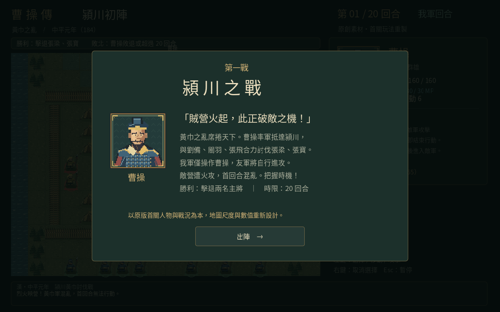
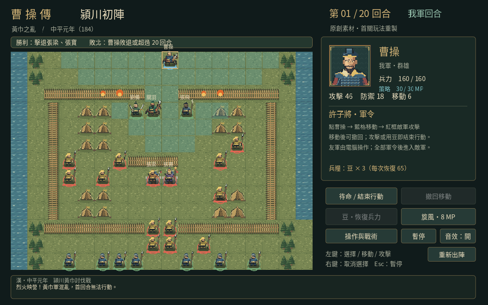

# 曹操傳・潁川初陣

以 Godot 4.6.3 製作的單關回合制戰棋。重現電腦版《三國志曹操傳》第一戰「潁川之戰」的主角、敵我關係與首關作戰情境；這是一個使用全新程式、美術、音效的非官方玩法重製專案，不是原版執行檔，也不是逐像素或精確數值複製。

## 遊戲截圖

### 出陣前劇情



### 戰場畫面

潁川之戰第一回合：戰棋地圖、部隊與曹操狀態。



## 開始遊戲

- Windows：解壓 Windows ZIP，執行 `Yingchuan.exe`。
- Linux：解壓 Linux ZIP，`chmod +x Yingchuan.x86_64` 後執行。
- Web：將 Web ZIP 全部檔案放在 HTTP 靜態伺服器，開啟 `index.html`。例如 `python3 -m http.server 8000`，瀏覽 `http://localhost:8000`。不要直接雙擊 HTML 使用 file://。
- 原始碼：Godot 4.6.3 匯入 `project.godot`，按 F6/F5 啟動。
- 建議滑鼠、1280×800 視窗；Godot 視窗縮放時維持畫面比例。

## 操作

1. 點「出陣」，點選曹操（藍色圈）。只有曹操由玩家控制。
2. 藍色格子是合法行軍範圍；滑鼠經過會畫出路徑。點目的格移動。
3. 點相鄰紅框敵軍攻擊。對方存活時會反擊。傷害固定，不使用隨機命中。
4. 移動後、攻擊或使用豆前，可點「撤回移動」。
5. 「豆・恢復兵力」恢復 65 兵力、消耗 1 豆與本回合行動，共 3 豆。
6. 「旋風」進入施法選取：點 3 格內的敵军，消耗 8 MP（初始 30），固定策略傷害，不受反擊，消耗本回合行動。右鍵取消施法。
7. 點「待命 / 結束行動」，友軍先行動，接著敵軍，再進下一回合。
8. 左側戰場可查看所有單位，右鍵取消選取。Esc 暫停；「操作與戰術」查看規則。
9. 「重新出陣」先顯示確認，取消會回到原進度。暫停、說明、重新出陣確認期間停止戰況演出。

勝利：張梁、張寶均敗退。敗北：曹操兵力歸零，或第 20 回合結束仍未取勝。火攻使敵軍第一回合混亂，無法行動。劉備、關羽、張飛與官軍自動作戰。首關友軍很強，完全待命也可能由友軍取勝，保留原作教學戰性質；主動參戰可較早結束戰鬥。

## 原版依據與重製界線

保留：潁川第一戰、曹操單人可操作、劉關張與普通友軍 AI、張梁／張寶兩名敵將和 12 名黃巾兵、7 名普通官軍、火攻混亂、20 回合時限、靠近敵將的交談、擊退雙將的目標。營地有南北入口、木柵、兩側營帳、東南兵糧庫及相鄰雙將。

適度改編：原地圖縮為 18×13，座標、兵力、攻防、移動力、地形加成、反擊、AI、豆數量與恢復值都是此版本的確定性設計，並非原版精確數據。普通友軍弓兵／策士／騎兵暫使用統一近戰規則和藍色兵士圖像；曹操保留初期「旋風」策略與移動力 6；策略的 MP、範圍與傷害為重製設計。未實作原作完整兵種、其他策略、經驗值、等級、裝備、寶物、劇情分支及後續關卡。敵將相鄰對話重新撰寫，許子將教學化為右側軍令與操作說明。沒有加入無證據的張飛／張寶單挑。

研究參考（僅作事實及構圖參考，未把參考圖片放入專案）：
- https://jingyan.baidu.com/article/f54ae2fce559655e92b849e0.html
- https://www.bilibili.com/opus/943136202416979992

本專案不包含原版遊戲圖像、程式、音樂或遊戲資料檔；角色名稱和歷史題材僅用來辨識關卡。沒有自動替使用者選擇程式碼授權；原始碼交付可編輯，後續使用和發布時請自行決定權利安排。

## 目錄與再生成

- `scripts/battle.gd`：資料、路徑、戰鬥、AI、勝負規則。
- `scripts/main.gd`：原創介面、動畫、操作、音效與教學。
- `tools/generate_art.py`：Pillow 原創像素素材生成器。
- `tools/subset_font.py`：由系統 Noto CJK 字體產生本專案中文字集。
- `assets/`：隨專案附帶的圖像与字體；所有遊戲圖像均由上述生成器原創。
- `FONT_LICENSE.txt`：Noto CJK 的 SIL Open Font License。
- `tests/test_battle.gd`：確定性規則測試與完整回合模擬。

## 驗證

```sh
godot --headless --path . --editor --import --quit
godot --headless --path . --script tests/test_battle.gd
godot --headless --path . --script tests/test_restart.gd
godot --headless --path . --script tests/test_wind_ui.gd
```

測試涵蓋軍隊數量、北門可達、河川與柵欄不可通行、禁止二次移動、撤回、豆消耗、攻擊承諾、雙將勝利、曹操敗退、20 回合失敗。完整正常初始戰鬥以合法移動和攻擊逐回合模擬獲勝；另以 1 HP 的明確 QA 夾具驗證真實反擊導致敗退，不以直接設定勝敗旗標代替。夾具不影響正常遊戲初始資料。

可在具有圖形顯示的環境產生遊戲自行擷取的畫面：
`godot --path . -- --qa-screenshot=/tmp/yingchuan.png`。
此參數略過開場，等待兩幀後存圖並結束。無圖形後端的 headless 模式不適合截圖。

Windows、Linux、Web 使用同一套程式，Web 不需要 SharedArrayBuffer 或跨來源隔離。Windows 匯出為 x86_64；目前的執行驗證以 Linux / Godot 為主，Windows 匯出不代表已在 Windows 實機跑過。
